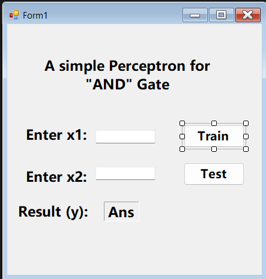

# Perceptron

Perceptron is a type of neural network algorithm that can be used for binary classification tasks, which involves separating data into two categories. It works by taking input values and computing a weighted sum, which is then passed through an activation function to produce an output. The output is compared to a desired output, and the weights are adjusted accordingly in order to improve the accuracy of the classification. 

## Perceptron for AND Gate

In the context of an AND gate, the Perceptron is a neural network algorithm that can be used to classify whether or not a given input falls within the AND gate category. An AND gate takes two binary inputs and produces a binary output that is 1 if and only if both inputs are 1, otherwise the output is 0.

The Perceptron algorithm for an AND gate can be trained using examples of input/output pairs of 0s and 1s that correspond to the AND gate truth table. The Perceptron takes the input values, multiplies them by their corresponding weights, and passes the resulting weighted sum through an activation function. In the case of an AND gate, the activation function produces a 1 if the weighted sum is greater than or equal to the threshold value, and 0 otherwise.

During training, the weights of the Perceptron are adjusted based on the errors between the predicted output and the desired output. Once the weights have been learned, the Perceptron can be used to classify new inputs into the correct category of the AND gate.

